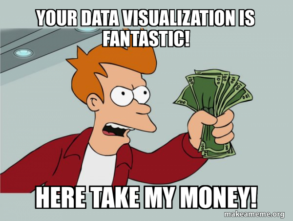
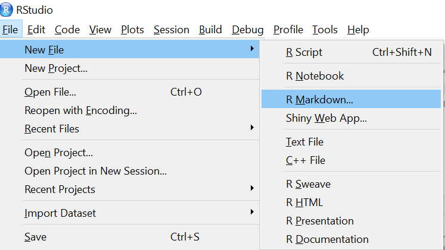
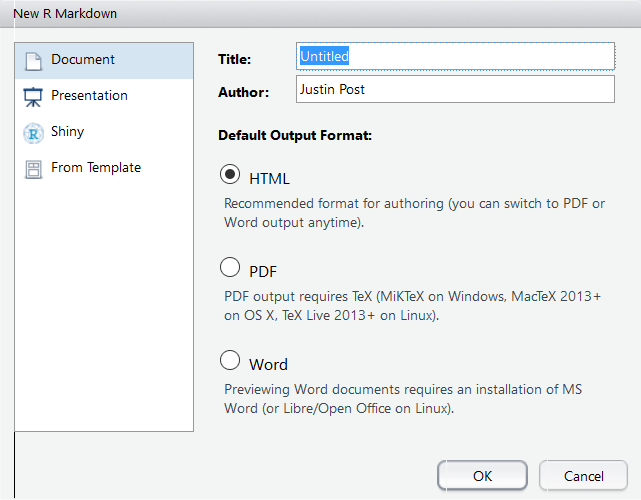
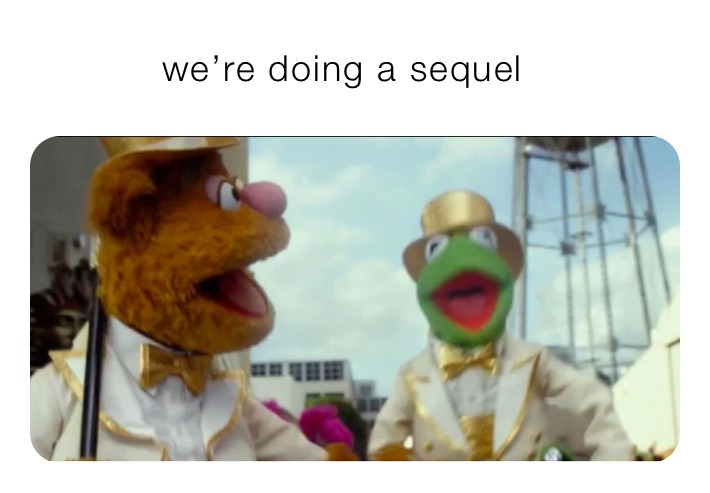
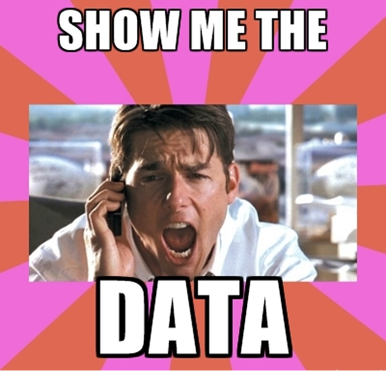
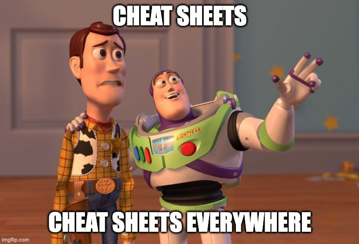

```{r setup, include=FALSE,warning=FALSE,message=FALSE}
options(htmltools.dir.version = FALSE)
knitr::opts_chunk$set(
  message = FALSE,
  warning = FALSE,
  dev = "svg",
  fig.align = "center"
  #fig.width = 11,
  #fig.height = 5
)

# define vars
om = par("mar")
lowtop = c(om[1],om[2],0.1,om[4])
library(tidyverse)
library(knitr)
options(dplyr.print_min = 5)

#library(dfexpand)
survey <- read_csv("https://www4.stat.ncsu.edu/~online/datasets/survey_results_public.csv")
```


layout: false
class: title-slide-section-red, middle

# Summarizing (& Documenting!) Data
Justin Post

---

layout: true

<div class="my-footer"></div> 

---

# ASA Fall Data Challenge

.pull-left[
Consulting!

> A startup is considering developing a bootcamp for coders and people who want to work as developers. They’ve hired your team to give them insights on their business model and want you to analyze the 2023 Stack Overflow Developer Survey.
]

--

.pull-right[
```{r, echo = FALSE, out.width='350px'}

```
]

---

# ASA Fall Data Challenge

Sufficient initial funding to focus on 2 languages and to initiate planning for a third. 

--

.pull-left[
- Recommendations for their focus?  

- Demographic characteristics?  
]


---

# ASA Fall Data Challenge

Sufficient initial funding to focus on 2 languages and to initiate planning for a third. 

.pull-left[
- Recommendations for their focus?  

- Demographic characteristics?  

- Visualizations to **comfort** investors?
]

.pull-right[
```{r, echo = FALSE, out.width='450px'}

```
]


---

# Final Product

- Create pdf slide presentation (< 11 slides)  

    + Clear how data is utilized  
    + Description of technical details

- Each member of the winning team will receive a $50 gift card.    

--

.pull-left[
# Goals

- Win!
]

.pull-right[
```{r, echo = FALSE, out.width='300px'}

```
]


---

# Final Product

- Create pdf slide presentation (< 11 slides)  

    + Clear how data is utilized  
    + Description of technical details

- Each member of the winning team will receive a $50 gift card.    


.pull-left[
# Goals

- Learn! (of course!)
]

.pull-right[
```{r, echo = FALSE, out.width='400px'}

```
]


---

# Group Chat!

.pull-left[
5ish minutes:

- Discuss your ideas after reading the survey
- Which parts are most relevant?
- What other data might be relevant?
- After discussion, write your consensus on the board (focus on the survey)!
]

.pull-right[
```{r, echo = FALSE, out.width='500px'}

```
]
<!-- Go over their thoughts-->


---

# How Do We ~~Win~~ Learn?

Workflow: 

- Read that data in!
    + Available at <https://www4.stat.ncsu.edu/~online/datasets/survey_results_public.csv>

--

- Validate/understand data

--

.pull-left[
- Modify data

- Create graphs/find insights

**Should document all of the above!**

- Create slides & communicate findings
]

---

# How Do We ~~Win~~ Learn?

Workflow: 

- Read that data in!
    + Available at <https://www4.stat.ncsu.edu/~online/datasets/survey_results_public.csv>


- Validate/understand data


.pull-left[
- Modify data

- Create graphs/find insights

**Should document all of the above!**

- Create slides & communicate findings
]

.pull-right[
```{r, echo = FALSE, out.width='500px'}

```
]


---

# R Markdown to the Rescue!

.pull-left[
Makes coding process reproducible and creation of documents natural!  

- `.Rmd` file extension
- Can create all sorts of documents with code and output embedded!
]

.pull-right[
```{r, out.width = '825px', echo = FALSE}
include_graphics("img/markdown.png")
```
]


---

# `.Rmd` Files

Three important types of content:
  
1. YAML header at top

    + Defines meta data
    
--

```
---
title: "Untitled"
author: "First Last"
date: "xxxx"
output: html_document
---
```  

---

# `.Rmd` Files

Three important types of content:
  
1. YAML header at top

    + Defines meta data
    
2. Chunks of R code   

    + Code that (may) evaluate and produce output
    
--

```{r chunk_png, out.width = "500px",echo=FALSE, fig.align='center'}
knitr::include_graphics("img/chunk.png")
``` 


---

# `.Rmd` Files

Three important types of content:
  
1. YAML header at top

    + Defines meta data
    
2. Chunks of R code   

    + Code that (may) evaluate and produce output

3. Text mixed with simple text formatting instructions (R Markdown syntax)

    + [Cheat sheet](https://www.rstudio.com/wp-content/uploads/2015/02/rmarkdown-cheatsheet.pdf)
  
---

# Create a `.Rmd`

Let's see how it works!

.pull-left[
```{r, echo = FALSE, out.width='550px'}

```
]

.pull-right[
```{r, echo = FALSE, out.width='550px'}

```
]


---

# Recap 

- R Markdown very powerful for optimizing workflow and reproducibility

.pull-left[
- Three main types of content

    1. YAML header
    2. Code chunks
    3. Markdown text
]

.pull-right[
```{r, echo = FALSE}

```
]


---

layout: false
class: title-slide-section-red, middle

.pull-left[
# Summarizing (& Documenting!) Data: Day 2
Justin Post
]

.pull-right[
```{r, echo = FALSE, out.width = '400px'}

```
]

---

layout: true

<div class="my-footer"></div> 

---

# We Got Data! Now what?

--

.pull-left[
```{r, echo = FALSE, out.width = '400px'}

```
]

--

.pull-right[
```{r}
str(survey)
```
]


---

# How to Summarize Data?

- Depends on data type:  

    + Categorical (Qualitative) variable - entries are a label or attribute   
    + Numeric (Quantitative) variable - entries are a numerical value where math can be performed


```{r, echo = FALSE, out.width="500px", fig.align='center'}
knitr::include_graphics("img/variableTypes.png")
```


---

# Categorical Data

Goal: Describe the **distribution** of the variable (and relate to other variables) 

- Try to describe relative frequency (or count) in each category

--

.pull-left[
- [Bar plots!](https://rstudio.github.io/cheatsheets/data-visualization.pdf)

```{r, eval = FALSE}
ggplot(data, aes(_map_data_set_values_to_plot_)) +
  geom_bar() +
  other_useful_layers()
```
]

.pull-right[
```{r, echo = FALSE, out.width = "400px"}
survey <- survey %>% 
  mutate(EdLevel2 = factor(EdLevel, 
                           levels = c(
                             "Something else", 
                             "Primary/elementary school",                                                         
                             "Secondary school (e.g. American high school, German Realschule or Gymnasium, etc.)",
                             "Some college/university study without earning a degree",
                             "Associate degree (A.A., A.S., etc.)",                                               
                             "Bachelor’s degree (B.A., B.S., B.Eng., etc.)",                                      
                             "Master’s degree (M.A., M.S., M.Eng., MBA, etc.)",                                   
                             "Professional degree (JD, MD, Ph.D, Ed.D, etc.)"                                    
                           ), 
                           labels = c("Other", 
                                      "Primary/Elementary", 
                                      "High School", 
                                      "Some College",
                                      "Associate's",
                                      "Bachelor's",
                                      "Master's", 
                                      "Professional Degree"),
                           ordered = TRUE),
         AISentiment = factor(AISent, 
                              levels = c("Very unfavorable", 
                                         "Unfavorable", 
                                         "Indifferent", 
                                         "Very favorable", 
                                         "Favorable", 
                                         "Unsure"),
                              ordered = TRUE)
         )

ggplot(survey %>% select(EdLevel2) %>% drop_na(), aes(x = EdLevel2)) + 
  geom_bar()
```
]


---

# Bar Plots

- Creating factors is the easiest way to work with labels/ordering!

```{r, eval = FALSE}
survey <- survey %>% 
  mutate(EdLevel2 = factor(EdLevel, 
                           levels = c(
                             "Something else", 
                             "Primary/elementary school",                                                         
                             "Secondary school (e.g. American high school, German Realschule or Gymnasium, etc.)",
                             "Some college/university study without earning a degree",
                             "Associate degree (A.A., A.S., etc.)",                                               
                             "Bachelor’s degree (B.A., B.S., B.Eng., etc.)",                                      
                             "Master’s degree (M.A., M.S., M.Eng., MBA, etc.)",                                   
                             "Professional degree (JD, MD, Ph.D, Ed.D, etc.)"                                    
                           ), 
                           labels = c("Other", 
                                      "Primary/Elementary", 
                                      "High School", 
                                      "Some College",
                                      "Associate's",
                                      "Bachelor's",
                                      "Master's", 
                                      "Professional Degree"),
                           ordered = TRUE)
         )
```


---

# Bar Plots

.pull-left[
```{r, eval = FALSE, out.width = "320px"}
ggplot(survey %>% 
         select(EdLevel2) %>% 
         drop_na(), 
       aes(x = EdLevel2)) + 
  geom_bar()
```
]

.pull-right[
```{r, echo = FALSE, out.width = "450px"}
ggplot(survey %>% 
         select(EdLevel2) %>% 
         drop_na(), 
       aes(x = EdLevel2)) + 
  geom_bar()
```
]

---

# Bar Plots

- Modify parts of plots with more layers!

.pull-left55[
```{r, echo = TRUE, eval = FALSE, out.width = "400px"}
ggplot(survey %>% 
         select(EdLevel2) %>% 
         drop_na(), 
       aes(x = EdLevel2)) + 
  geom_bar() +
  scale_x_discrete(guide = guide_axis(angle = 45)) + #<<
  labs(x = "Education Level", #<<
       title = "Most Respondents have a Bachelor's or
          Master's Degree") #<<
```
]

--

.pull-right45[
```{r, echo = FALSE, out.width = "400px"}
ggplot(survey %>% 
         select(EdLevel2) %>% 
         drop_na(), 
       aes(x = EdLevel2)) + #factor version of Education 
  geom_bar() +
  scale_x_discrete(guide = guide_axis(angle = 45)) +
  labs(x = "Education Level",
       title = "Most Respondents have a Bachelor's or 
          Master's Degree") 
```
]


---

# Bar Plots

- Use `fill = another_variable`

.pull-left55[
```{r, echo = TRUE, eval = FALSE, out.width = "400px"}
ggplot(survey %>% 
         select(EdLevel2, AISentiment) %>% 
         filter(AISentiment != "Unsure") %>%
         drop_na(), 
       aes(x = EdLevel2, fill = AISentiment)) + #<<
  geom_bar() +
  scale_x_discrete(guide = guide_axis(angle = 45)) +
  labs(x = "Education Level",
       title = "Most Respondents have a Bachelor's or 
          Master's Degree") 
```
]

.pull-right45[
```{r, echo = FALSE, out.width = "400px"}
ggplot(survey %>% 
         select(EdLevel2, AISentiment) %>% 
         filter(AISentiment != "Unsure") %>%
         drop_na(), 
       aes(x = EdLevel2, fill = AISentiment)) + #<<
  geom_bar() +
  scale_x_discrete(guide = guide_axis(angle = 45)) +
  labs(x = "Education Level",
       title = "Most Respondents have a Bachelor's or 
          Master's Degree") 
```
]


---

# Bar Plots

- Faceting allows for creating similar plots at each *setting* of another variable

.pull-left55[
```{r, eval = FALSE}
ggplot(survey %>% 
         select(EdLevel2, AISentiment, SOAccount) %>% 
         filter(AISentiment != "Unsure") %>%
         drop_na(), 
       aes(x = EdLevel2, fill = AISentiment)) +
  geom_bar() +
  facet_wrap(~SOAccount) + #<<
  scale_x_discrete(guide = guide_axis(angle = 45)) +
  labs(x = "Education Level",
       title = "Most Respondents have a Bachelor's or 
          Master's Degree", 
       subtitle = "Favorable or Very Favorable Opinions 
       of AI are Consistent Across Education Groups\n
       Trends are similar for those with and without a 
       Stack Overflow Account")
```
]

.pull-right45[
```{r, echo = FALSE, out.width = "450px"}
ggplot(survey %>% 
         select(EdLevel2, AISentiment, SOAccount) %>% 
         filter(AISentiment != "Unsure") %>%
         drop_na(), 
       aes(x = EdLevel2, fill = AISentiment)) +
  geom_bar() +
  facet_wrap(~SOAccount) + #<<
  scale_x_discrete(guide = guide_axis(angle = 45)) +
  labs(x = "Education Level",
       title = "Most Respondents have a Bachelor's or 
          Master's Degree", 
       subtitle = "Favorable or Very Favorable Opinions 
       of AI are Consistent Across Education Groups\n
       Trends are similar for those with and without a 
       Stack Overflow Account")
```
]


---

# `ggplot()`

- Other plots follow a similar structure! 
- Keep the cheat sheet handy!

```{r, echo = FALSE, out.width = "355px"}

```

